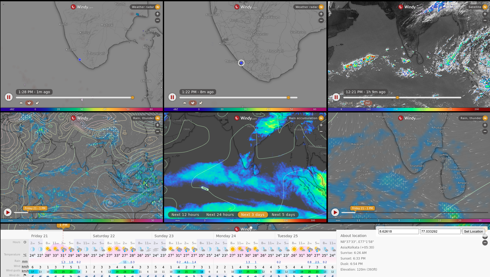

# Live Weather Viewer ☁️⛈️

Live Weather Viewer is an interactive HTML dashboard that displays real-time radar, satellite, and model forecast data from [Windy.com](https://www.windy.com/). This dashboard allows users to monitor multiple weather parameters simultaneously, making it easier to track live weather conditions.

## Features ✨

- **Live Radar & Satellite Data** 🛁  
  Get real-time weather radar and satellite imagery for your location.

- **Rain & Thunder Forecast** ⛈️  
  Visualize ECMWF model forecasts, including rain accumulation and thunderstorm probabilities.

- **Custom Location Selection** 📍  
  Set your preferred location to view relevant weather data.

- **Multi-Panel Layout** 📊  
  Compare different weather parameters at a glance in a single dashboard.

## How to Use 🚀

1. Download or clone this repository.
2. Open `liveweatherviewer.html` in your web browser.
3. Set your location using the built-in selection tool.
4. Monitor live weather conditions with real-time updates.

## License 📝

This project is open-source and free to use. Feel free to contribute or modify as needed.
[GNU General Public License v3 (GPLv3)](https://www.gnu.org/licenses/gpl-3.0.en.html)
